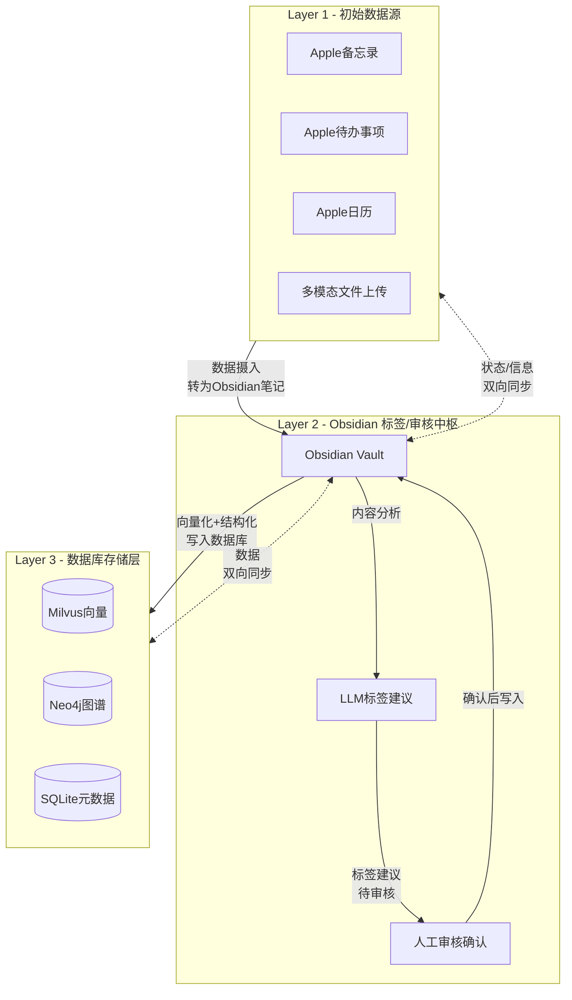
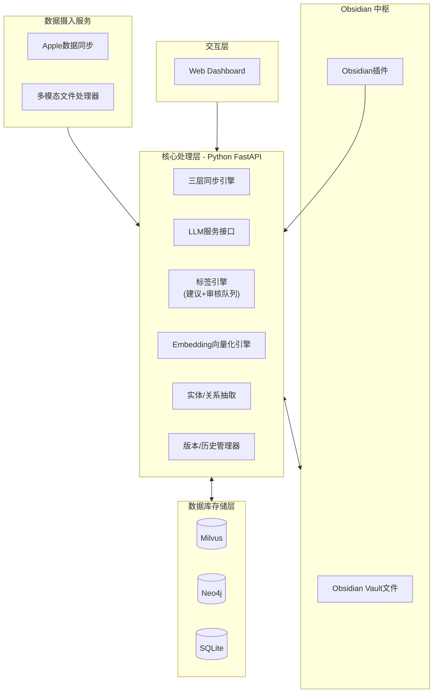
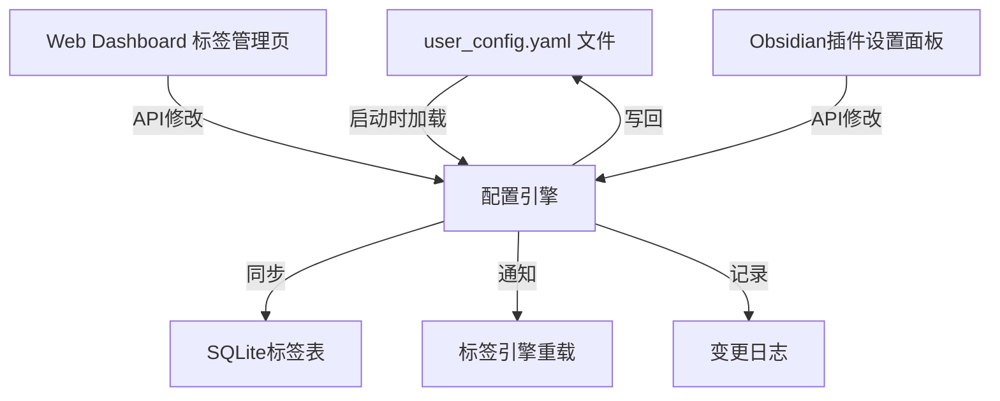
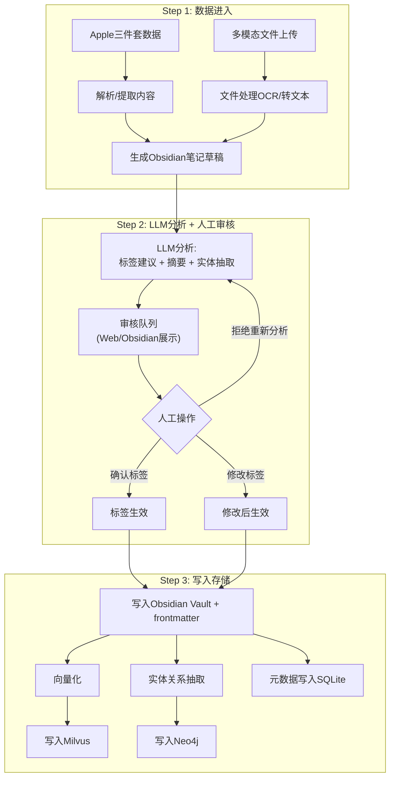
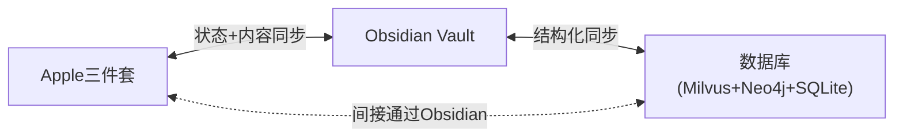
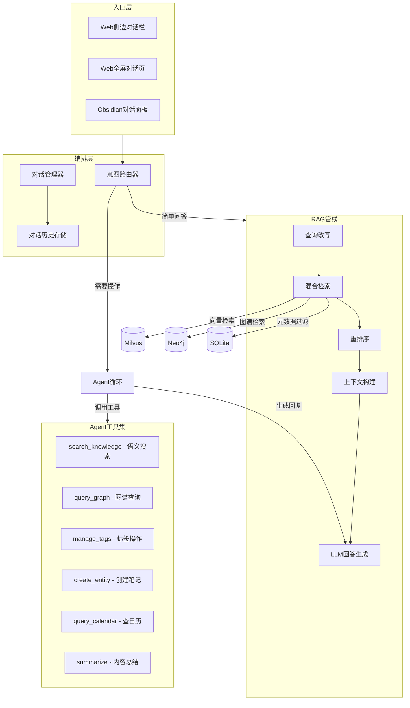
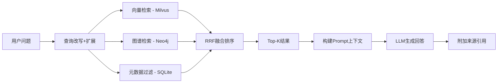

# 第二大脑 - 人生价值系统 (dierdanao)

## 一、系统架构总览

### 1.1 数据流层级（核心原则）

数据流是**分层单向流入、三层双向同步**的结构，Obsidian 是标签/审核中枢，不是普通数据源：




**核心数据流**：

1. Apple三件套 + 文件上传 是**初始数据入口**，数据自动转为 Obsidian 笔记
2. Obsidian 是**中央枢纽**：所有数据在此打标签、审核、组织
3. LLM 提供标签建议，但**必须经过人工审核确认**才能生效
4. 审核通过后，数据向量化并写入数据库层
5. 三层之间**双向同步**：Apple 状态变更 -> Obsidian 更新 -> 数据库更新，反之亦然

### 1.2 系统组件架构




## 二、技术栈选型

- **后端**: Python 3.11+ / FastAPI — AI生态最丰富，Milvus Python SDK成熟
- **向量数据库**: Milvus (Standalone模式，Docker本地部署)
- **知识图谱**: Neo4j Community Edition (Docker本地部署，Cypher查询)
- **元数据库**: SQLite — 零配置，本地文件级数据库，存储标签定义、实体元数据、同步状态
- **前端**: React + TypeScript + TailwindCSS + Vite
  - 图谱可视化: D3.js 或 react-force-graph
  - 图表/仪表盘: Recharts
- **Obsidian插件**: TypeScript，Obsidian Plugin API
- **Apple数据同步**: macOS原生 `osascript` (AppleScript/JXA) + Python subprocess
- **LLM接口**: 用户提供的API端点，系统封装统一调用层
- **容器化**: Docker Compose 编排 Milvus + Neo4j
- **认证**: JWT Token（FastAPI + python-jose）
- **元数据库升级考量**: 当前用 SQLite（个人/小团队够用），预留 PostgreSQL 迁移接口（企业版可平滑切换）

## 三、多用户 + 权限系统 (RBAC)

从 Phase 1 起内置多用户和角色权限，支持个人使用（单用户模式）和团队协作（5-7人企业模式）。

### 3.0 角色与权限矩阵

两种预设角色，管理员可自定义新角色：

**管理员 (admin)**:

- 全部数据的读写权限
- 配置标签体系、同步规则
- 管理用户账户、分配角色
- 配置员工可见内容范围（按标签/文件夹/来源 维度）
- 查看所有用户的操作日志
- 审核队列管理权限

**员工 (member)**:

- 上传文件到系统
- 查询/搜索**管理员授权范围内**的数据
- 在授权范围内使用问答系统
- 查看/编辑自己上传的内容
- 给内容打标签（受限于授权的标签范围）
- 不能修改标签体系、不能管理用户

**权限控制粒度**（管理员可为每个角色/用户配置）:

```yaml
# user_config.yaml 中的权限配置段
roles:
  admin:
    permissions: ["*"]           # 全部权限
  member:
    permissions:
      - "entity:create"          # 上传/创建
      - "entity:read:authorized" # 只读授权范围
      - "entity:tag:authorized"  # 在授权范围内打标签
      - "search:authorized"      # 搜索授权范围
      - "chat:authorized"        # 问答授权范围
    visible_scope:               # 管理员配置可见内容范围
      folder_tags: ["领域/学习", "领域/投资", "资源/*"]  # 可见的树形标签
      content_tags: ["学习", "研究", "资料"]              # 可见的内容标签
      sources: ["upload", "obsidian"]                     # 可见的数据来源
      exclude_tags: ["领域/家庭", "归档/日记"]            # 明确排除的内容
```

### 3.0.1 数据库设计

```sql
-- 用户表
CREATE TABLE users (
    id TEXT PRIMARY KEY,
    username TEXT NOT NULL UNIQUE,
    password_hash TEXT NOT NULL,
    display_name TEXT,
    role TEXT NOT NULL DEFAULT 'member',  -- "admin","member",或自定义角色名
    is_active BOOLEAN DEFAULT TRUE,
    created_at TIMESTAMP,
    last_login_at TIMESTAMP
);

-- 角色权限定义（对应 YAML 中的 roles 段）
CREATE TABLE role_permissions (
    role TEXT NOT NULL,
    permission TEXT NOT NULL,     -- 如 "entity:read:authorized"
    scope_config JSON,            -- 可见范围配置
    PRIMARY KEY (role, permission)
);

-- 操作日志（审计追踪）
CREATE TABLE audit_log (
    id TEXT PRIMARY KEY,
    user_id TEXT NOT NULL REFERENCES users(id),
    action TEXT NOT NULL,         -- "create_entity","approve_tag","search","chat"等
    target_type TEXT,             -- "entity","tag","config"
    target_id TEXT,
    detail JSON,
    created_at TIMESTAMP
);
```

### 3.0.2 单用户 / 多用户模式切换

```env
# .env
AUTH_MODE=single    # "single" = 个人模式（无需登录），"multi" = 团队模式（需登录）
ADMIN_USERNAME=admin
ADMIN_PASSWORD=changeme   # 首次启动时的管理员密码
```

- `single` 模式：跳过认证，所有请求视为 admin 权限，个人使用零摩擦
- `multi` 模式：JWT 登录，所有 API 鉴权，前端显示登录页面

### 3.0.3 API 层权限中间件

每个 API 端点声明所需权限，中间件自动校验：

```python
@router.get("/entities/{id}")
@require_permission("entity:read")  # 中间件自动检查用户角色+可见范围
async def get_entity(id: str, user: User = Depends(get_current_user)):
    # 如果是 member，自动过滤只返回授权范围内的数据
    ...
```

## 四、可复用 / 可移植设计

系统设计为**环境无关**，任何 Mac 用户只需 3 步即可部署自己的第二大脑：

```bash
# 1. 克隆项目
git clone <repo> && cd dierdanao

# 2. 复制并编辑配置（唯一需要改的文件）
cp .env.example .env           # 编辑环境变量（路径、端口等）
cp backend/config/user_config.example.yaml backend/config/user_config.yaml
                               # 编辑标签体系、Obsidian Vault路径等

# 3. 一键启动
make setup   # 安装依赖 + 启动 Docker + 初始化数据库 + 启动后端 + 启动前端
```

### 3.0.1 环境配置分离

所有环境相关的变量集中在 `.env` 文件中，代码中**零硬编码路径**：

```env
# ============================================
# .env - 环境配置（每个用户各不相同）
# ============================================

# --- 路径 ---
OBSIDIAN_VAULT_PATH=~/Documents/ObsidianVault   # 你的Obsidian Vault路径
DATA_DIR=~/.dierdanao/data                       # 数据存储目录（SQLite、上传文件等）

# --- 服务端口 ---
BACKEND_PORT=8000
FRONTEND_PORT=3000
MILVUS_PORT=19530
NEO4J_HTTP_PORT=7474
NEO4J_BOLT_PORT=7687

# --- LLM ---
LLM_API_URL=http://localhost:11434/v1            # 你的LLM API地址
LLM_MODEL=qwen2.5
EMBEDDING_MODEL=bge-m3
EMBEDDING_DIM=1024

# --- Neo4j ---
NEO4J_USER=neo4j
NEO4J_PASSWORD=dierdanao123
```

### 3.0.2 配置层级

```
.env                          <- 环境级（路径/端口/密码，git-ignored）
.env.example                  <- 环境模板（随代码提交，有注释说明）
backend/config/
  user_config.yaml            <- 用户级（标签体系/同步规则，git-ignored）
  user_config.example.yaml    <- 用户配置模板（随代码提交，含默认标签体系）
  system_config.yaml          <- 系统级（不变的默认值，随代码提交）
```

- `.env` + `user_config.yaml` 被 `.gitignore` 排除，个人数据不入库
- `.env.example` + `user_config.example.yaml` 随代码提交，新用户复制后编辑即可
- `system_config.yaml` 存放系统默认值（如审核队列默认行为、向量检索参数等）

### 3.0.3 自动化脚本 (Makefile)

```makefile
setup:          # 首次安装：依赖 + Docker + 数据库 + 全部启动
check-deps:     # 检查前置依赖（Docker/Python/Node/Obsidian）
start:          # 启动所有服务（Docker + 后端 + 前端）
stop:           # 停止所有服务
reset-db:       # 重置数据库（保留配置）
backup:         # 备份数据（SQLite + 上传文件 + 配置）
restore:        # 从备份恢复
dev:            # 开发模式（热重载）
logs:           # 查看所有服务日志
health:         # 健康检查（各服务状态）
```

### 3.0.4 新用户部署清单

1. 前置条件：macOS, Docker Desktop, Python 3.11+, Node.js 18+, Obsidian
2. `cp .env.example .env` -> 修改 `OBSIDIAN_VAULT_PATH` 和 `LLM_API_URL`
3. `cp backend/config/user_config.example.yaml backend/config/user_config.yaml` -> 按自己需求调整标签体系
4. `make setup`
5. 浏览器打开 `http://localhost:3000`
6. Obsidian 安装插件（指向 `http://localhost:8000`）

全程不需要改任何代码，只改两个配置文件。

## 四、核心数据模型

### 4.1 用户配置系统（全局可调节）

系统的标签体系、文件夹映射、同步规则等全部通过 YAML 配置文件定义，用户可直接编辑文件或通过 Web UI / Obsidian 插件修改。配置变更实时生效，无需重启。

配置文件位于 `backend/config/user_config.yaml`，系统启动时加载，API 支持热更新。

```yaml
# ============================================
# 第二大脑 - 用户配置文件
# 所有标签、文件夹映射、同步规则均可自由调整
# ============================================

# --- Obsidian Vault 路径 ---
obsidian:
  vault_path: "/Users/old/ObsidianVault"   # 用户自行设置
  sync_interval_minutes: 10

# --- 树形结构标签 (对应 Obsidian 文件夹结构) ---
# 用户可随时增删改层级，系统自动同步
folder_tree:
  - name: 归档
    icon: "📦"
    children:
      - name: 历史资料
      - name: 每周复盘
      - name: 日记
      - name: 无效参考
      - name: 已完成项目
      - name: 暂停事项
  - name: 领域
    icon: "🧭"
    children:
      - name: 第二大脑
      - name: 家庭
      - name: 健康
      - name: 三观
      - name: 投资
      - name: 学习
  - name: 模板
    icon: "📋"
  - name: 其他
    icon: "📎"
  - name: 项目
    icon: "🎯"
    children:
      - name: 532方案搭建
      - name: 不良资产
      - name: 海南垃圾处理项目
      - name: 展麟收尾事项
      - name: 自媒体号成立
  - name: 资源
    icon: "💎"
    children:
      - name: 参考
      - name: 灵感
      - name: 模型碎片

# --- 内容标签 (扁平标签，用于标注内容性质) ---
# 这些标签可直接对应 Obsidian 中的 #tag
content_tags:
  - name: 学习
    color: "#4A90D9"
  - name: 反思
    color: "#E67E22"
  - name: 研究
    color: "#27AE60"
  - name: 资料
    color: "#8E44AD"
  - name: 问题
    color: "#E74C3C"
  - name: 想法
    color: "#F1C40F"
  - name: 笔记
    color: "#3498DB"
  - name: 待思考
    color: "#95A5A6"
  - name: 复盘
    color: "#1ABC9C"
  - name: 已完成
    color: "#2ECC71"
  - name: 整理
    color: "#9B59B6"
  # 用户可随时添加新标签...

# --- 状态标签维度 (每个维度是独立的筛选轴) ---
# 用户完全自定义维度名称和可选值
status_dimensions:
  - key: priority
    display_name: 优先级
    options: ["P0", "P1", "P2", "P3"]
    default: "P2"
  - key: stage
    display_name: 阶段
    options: ["想法", "进行中", "已完成", "归档"]
    default: "想法"
  # 用户可随时添加新的状态维度...
  # - key: emotion
  #   display_name: 情绪
  #   options: ["积极", "中性", "消极"]

# --- LLM 配置 ---
llm:
  api_url: "http://localhost:11434/v1"  # 用户提供的LLM API地址
  model: "qwen2.5"                       # 模型名称
  embedding_model: "bge-m3"              # Embedding模型
  embedding_dim: 1024                    # 向量维度

# --- Apple 同步配置 ---
apple_sync:
  enabled: true
  auto_sync: true
  interval_minutes: 30
  sources:
    notes: true
    reminders: true
    calendar: true
```

### 3.2 标签体系数据库设计

标签分三层：树形文件夹标签、扁平内容标签、状态维度标签。数据库与 YAML 配置双向同步。

```sql
-- 树形文件夹标签（对应 Obsidian 文件夹结构）
CREATE TABLE tag_tree (
    id TEXT PRIMARY KEY,
    name TEXT NOT NULL,
    parent_id TEXT REFERENCES tag_tree(id),
    path TEXT NOT NULL,          -- 如 "领域/健康"
    icon TEXT,
    sort_order INTEGER DEFAULT 0,
    created_at TIMESTAMP,
    updated_at TIMESTAMP
);

-- 扁平内容标签（对应 Obsidian #tag）
CREATE TABLE content_tags (
    id TEXT PRIMARY KEY,
    name TEXT NOT NULL UNIQUE,   -- 如 "学习","反思","研究"
    color TEXT,                  -- 显示颜色
    usage_count INTEGER DEFAULT 0,
    created_at TIMESTAMP
);

-- 状态标签维度定义（用户自定义轴）
CREATE TABLE status_dimensions (
    id TEXT PRIMARY KEY,
    key TEXT NOT NULL UNIQUE,     -- 如 "priority"
    display_name TEXT,            -- 如 "优先级"
    options JSON NOT NULL,        -- ["P0","P1","P2","P3"]
    default_value TEXT,
    created_at TIMESTAMP
);

-- 实体标签绑定（一个实体可绑多个标签）
CREATE TABLE entity_tags (
    entity_id TEXT NOT NULL,
    tag_tree_id TEXT REFERENCES tag_tree(id),
    content_tag_ids JSON,         -- ["学习","研究"]
    status_values JSON,           -- {"priority":"P1","stage":"进行中"}
    created_at TIMESTAMP,
    PRIMARY KEY (entity_id, tag_tree_id)
);

-- 配置变更日志（追踪标签体系调整历史）
CREATE TABLE config_changelog (
    id INTEGER PRIMARY KEY AUTOINCREMENT,
    change_type TEXT NOT NULL,    -- "add_tag","rename_tag","delete_tag","reorder"等
    target TEXT NOT NULL,         -- 变更目标描述
    old_value JSON,
    new_value JSON,
    changed_at TIMESTAMP DEFAULT CURRENT_TIMESTAMP
);
```

### 3.3 配置管理流程




用户修改配置的三种方式，全部等价：

- 直接编辑 `user_config.yaml` 文件（系统监听文件变更，自动重载）
- 通过 Web Dashboard 的标签管理页面拖拽/编辑（API 写回 YAML + 更新 DB）
- 通过 Obsidian 插件设置面板（API 写回 YAML + 更新 DB）

### 3.4 实体数据模型

```sql
-- 核心实体表
CREATE TABLE entities (
    id TEXT PRIMARY KEY,
    source TEXT NOT NULL,          -- "apple_notes","apple_reminders","apple_calendar","upload"
    source_id TEXT,                -- Apple中的原始ID（用于双向同步）
    title TEXT,
    content TEXT,
    content_type TEXT,             -- "text","image","audio","video","pdf"
    obsidian_path TEXT,            -- Obsidian中的文件路径（中枢位置）
    file_path TEXT,                -- 原始文件路径（附件等）
    metadata JSON,                 -- 源特定元数据（日历时间、待办状态等）
    current_version INTEGER DEFAULT 1,  -- 当前版本号
    milvus_id TEXT,                -- Milvus中的向量ID
    neo4j_node_id TEXT,            -- Neo4j中的节点ID
    review_status TEXT DEFAULT 'pending', -- "pending","reviewed","auto"(已信任的源)
    content_hash TEXT,             -- 内容哈希（用于变更检测）
    created_at TIMESTAMP,
    updated_at TIMESTAMP,
    synced_at TIMESTAMP
);
```

### 3.5 数据摄入流程（Apple/上传 -> Obsidian -> 数据库）




### 3.6 人工审核机制

LLM 标签建议**绝不自动生效**，必须经过人工审核：

- **审核队列**: 所有待审核的标签建议集中展示，Web Dashboard 有专门的审核面板，Obsidian 插件有审核侧栏
- **审核操作**: 每条建议可以 [确认] / [修改后确认] / [拒绝并重新分析]
- **批量审核**: 支持一键确认多条、批量修改
- **置信度提示**: LLM 对每个标签建议附带置信度分数，低置信度标红提醒用户重点审核
- **审核记录**: 每次人工修正都记录下来，用于后续微调 LLM 的标签建议准确度

```sql
-- 审核队列表
CREATE TABLE review_queue (
    id TEXT PRIMARY KEY,
    entity_id TEXT NOT NULL REFERENCES entities(id),
    suggested_folder_tags JSON,     -- LLM建议的树形标签 ["领域/投资"]
    suggested_content_tags JSON,    -- LLM建议的内容标签 ["研究","资料"]
    suggested_status JSON,          -- LLM建议的状态 {"priority":"P1"}
    confidence_scores JSON,         -- 各标签的置信度 {"领域/投资":0.92,"研究":0.78}
    status TEXT DEFAULT 'pending',  -- "pending","approved","modified","rejected"
    reviewer_action JSON,           -- 人工修改记录
    created_at TIMESTAMP,
    reviewed_at TIMESTAMP
);
```

### 3.7 三层同步 + 版本历史

三层数据（Apple源 / Obsidian / 数据库）需要保持同步，同时保留完整历史。

**同步方向**:




**同步场景举例**:

- Apple 待办标记完成 -> Obsidian 对应笔记状态更新为"已完成" -> SQLite 状态字段更新
- Obsidian 中修改笔记内容 -> Milvus 重新向量化 -> Neo4j 更新实体关系
- Web Dashboard 修改标签 -> SQLite 更新 -> Obsidian frontmatter 同步更新

**版本历史系统**:

信息更新时**保留旧版本**，状态变更时**记录时间线**：

```sql
-- 实体版本历史（信息变更保留完整快照）
CREATE TABLE entity_versions (
    id TEXT PRIMARY KEY,
    entity_id TEXT NOT NULL REFERENCES entities(id),
    version_number INTEGER NOT NULL,
    title TEXT,
    content TEXT,
    metadata JSON,
    tags_snapshot JSON,            -- 当时的标签状态快照
    change_source TEXT,            -- "apple_sync","obsidian_edit","web_edit","api"
    change_summary TEXT,           -- 变更摘要（可由LLM自动生成）
    created_at TIMESTAMP,
    UNIQUE(entity_id, version_number)
);

-- 状态变更时间线（每次状态转换的精确记录）
CREATE TABLE status_timeline (
    id TEXT PRIMARY KEY,
    entity_id TEXT NOT NULL REFERENCES entities(id),
    dimension TEXT NOT NULL,       -- "stage","priority" 等状态维度
    old_value TEXT,
    new_value TEXT,
    changed_by TEXT,               -- "user","apple_sync","llm_suggest"
    changed_at TIMESTAMP NOT NULL,
    note TEXT                      -- 可选备注，如"项目延期，优先级下调"
);

-- 同步状态追踪（三层间的同步校验）
CREATE TABLE sync_state (
    entity_id TEXT NOT NULL,
    layer TEXT NOT NULL,           -- "apple","obsidian","database"
    content_hash TEXT,             -- 内容哈希，用于检测变更
    last_synced_at TIMESTAMP,
    sync_status TEXT DEFAULT 'synced', -- "synced","pending","conflict"
    PRIMARY KEY (entity_id, layer)
);
```

**冲突处理策略**:

- 同一实体在多层同时修改时，产生冲突标记
- Web Dashboard 提供冲突解决界面：并排对比两个版本，人工选择保留哪个
- 默认策略：最新时间戳优先，但不丢弃旧版本（存入 entity_versions）

## 四、问答框架 (RAG + Agent)

### 4.1 整体架构

分三个递进层级实现，从基础 RAG 到完整 Agent：




### 4.2 三层递进实现

**Level 1 - 基础 RAG（Phase 3 实现）**

用户提问 -> 查询向量化 -> Milvus 相似度检索 + Neo4j 图谱补充 -> 拼接上下文 -> LLM 生成回答 + 来源引用

```
用户: "我之前关于投资的想法有哪些？"
系统:
  1. Embedding("关于投资的想法") -> 向量
  2. Milvus 相似度搜索 top-K + SQLite 过滤标签含"投资"或"想法"
  3. Neo4j 补充关联实体
  4. 拼接检索结果为上下文
  5. LLM 生成综合回答
  6. 附带来源: [备忘录-投资笔记-2025.12], [Obsidian-领域/投资/xxx.md]
```

**Level 2 - 多轮对话（Phase 3 实现）**

在 Level 1 基础上增加：

- 对话历史存储（SQLite `conversations` + `messages` 表）
- 查询改写：结合历史上下文重写用户问题（解决代词指代、省略等）
- 对话摘要：长对话自动压缩，避免 token 溢出

```
用户: "我之前关于投资的想法有哪些？"
系统: "你有3条相关记录：1) xxx 2) yyy 3) zzz"
用户: "第二条详细说说"    <- 需要理解"第二条"指 yyy
系统: 改写为 "详细展开 yyy 的内容" -> 检索 -> 回答
```

**Level 3 - Agent 模式（Phase 4 实现）**

LLM 作为智能 Agent，具备工具调用能力，不仅回答问题，还能执行操作：

```
用户: "帮我把今天的会议记录整理一下，打上'复盘'标签，归到'项目/532方案搭建'下面"
Agent:
  思考: 需要执行三步操作
  -> 调用 search_knowledge("今天的会议记录") 找到实体
  -> 调用 manage_tags(entity_id, add_content_tag="复盘")
  -> 调用 manage_tags(entity_id, set_folder="项目/532方案搭建")
  回复: "已完成，会议记录已标记为'复盘'并归入'项目/532方案搭建'。"
```

### 4.3 Agent 工具定义


| 工具名                | 功能         | 参数                                                        |
| ------------------ | ---------- | --------------------------------------------------------- |
| `search_knowledge` | 语义搜索知识库    | query, filters(标签/时间/来源), top_k                           |
| `query_graph`      | 查询知识图谱关系   | entity, relation_type, depth                              |
| `manage_tags`      | 增删改标签绑定    | entity_id, add/remove content_tag, set folder, set status |
| `create_entity`    | 创建新笔记/实体   | title, content, tags, folder                              |
| `update_entity`    | 修改已有实体内容   | entity_id, new_content                                    |
| `query_calendar`   | 查询日历事件     | date_range, keyword                                       |
| `query_reminders`  | 查询待办事项     | status, date_range                                        |
| `summarize`        | 对多个实体内容做总结 | entity_ids, style(简要/详细)                                  |


### 4.4 对话数据模型

```sql
-- 对话会话
CREATE TABLE conversations (
    id TEXT PRIMARY KEY,
    title TEXT,                    -- 自动从首条消息生成
    created_at TIMESTAMP,
    updated_at TIMESTAMP,
    summary TEXT,                  -- 长对话的压缩摘要
    metadata JSON                  -- 关联的标签/实体等上下文
);

-- 对话消息
CREATE TABLE messages (
    id TEXT PRIMARY KEY,
    conversation_id TEXT NOT NULL REFERENCES conversations(id),
    role TEXT NOT NULL,            -- "user","assistant","system","tool"
    content TEXT NOT NULL,
    tool_calls JSON,               -- Agent模式下的工具调用记录
    tool_results JSON,             -- 工具返回结果
    sources JSON,                  -- 引用的实体ID列表 ["entity_id_1","entity_id_2"]
    created_at TIMESTAMP
);
```

### 4.5 RAG 检索策略

采用混合检索，三路并行后融合排序：




- **向量检索**: Milvus ANN 搜索，召回语义相关内容
- **图谱检索**: 从问题中抽取实体，Neo4j 查找 1-2 跳关联节点
- **元数据过滤**: 时间范围、标签、来源类型等结构化条件
- **RRF 融合**: Reciprocal Rank Fusion 合并三路结果，避免单一路径偏差

## 五、项目目录结构

```
dierdanao/
├── .env.example                    # 环境变量模板（路径/端口/密码）
├── .env                            # 实际环境变量（git-ignored）
├── .gitignore
├── Makefile                        # 自动化脚本（setup/start/stop/backup等）
├── docker-compose.yml              # Milvus + Neo4j 编排（读取.env中的端口配置）
├── scripts/
│   ├── setup.sh                    # 首次安装脚本（检查依赖+安装+初始化）
│   ├── check_deps.sh              # 前置依赖检查（Docker/Python/Node等）
│   └── backup.sh                  # 数据备份脚本
├── backend/
│   ├── pyproject.toml              # Python依赖管理
│   ├── config/
│   │   ├── user_config.yaml        # 用户配置（标签/同步/LLM，git-ignored）
│   │   ├── user_config.example.yaml # 用户配置模板（随代码提交）
│   │   ├── system_config.yaml      # 系统默认配置（随代码提交）
│   │   └── user_config.schema.json # 配置文件的JSON Schema（用于校验）
│   ├── app/
│   │   ├── main.py                 # FastAPI入口
│   │   ├── config.py               # 配置加载引擎（读YAML+监听变更+热更新）
│   │   ├── auth/
│   │   │   ├── jwt.py              # JWT token 生成/验证
│   │   │   ├── dependencies.py     # get_current_user / require_permission 依赖注入
│   │   │   └── models.py           # User / Role Pydantic模型
│   │   ├── api/
│   │   │   ├── auth.py             # 登录/注册/刷新token/用户管理 API
│   │   │   ├── entities.py         # 实体CRUD API（含版本历史查询+权限过滤）
│   │   │   ├── tags.py             # 标签管理API（树形/内容/状态三类）
│   │   │   ├── review.py           # 审核队列API（获取待审/确认/修改/拒绝/批量）
│   │   │   ├── config.py           # 用户配置CRUD API（仅admin）
│   │   │   ├── search.py           # 语义搜索API
│   │   │   ├── chat.py             # 问答对话API（SSE流式输出）
│   │   │   ├── graph.py            # 知识图谱查询API
│   │   │   ├── sync.py             # 三层同步API（触发同步/状态查看/冲突解决）
│   │   │   ├── history.py          # 版本历史API（版本对比/状态时间线/回滚）
│   │   │   └── upload.py           # 文件上传API
│   │   ├── services/
│   │   │   ├── llm_service.py      # LLM统一调用层（chat + embedding）
│   │   │   ├── embedding_service.py # 向量化服务
│   │   │   ├── tag_engine.py       # 标签引擎（LLM建议 -> 审核队列 -> 生效）
│   │   │   ├── review_service.py   # 人工审核服务（队列管理+批量操作）
│   │   │   ├── sync_engine.py      # 三层同步引擎（Apple<->Obsidian<->DB）
│   │   │   ├── version_manager.py  # 版本历史管理（快照+状态时间线+冲突）
│   │   │   ├── config_engine.py    # 配置引擎（YAML读写+DB同步+文件监听）
│   │   │   ├── entity_extractor.py # 实体关系抽取
│   │   │   └── file_processor.py   # 多模态文件处理
│   │   ├── chat/
│   │   │   ├── router.py           # 意图路由（简单问答 vs Agent）
│   │   │   ├── rag_pipeline.py     # RAG管线（检索+重排+上下文构建）
│   │   │   ├── agent.py            # Agent循环（工具调用编排）
│   │   │   ├── tools.py            # Agent工具定义与实现
│   │   │   ├── conversation.py     # 对话管理（历史+摘要+改写）
│   │   │   └── prompts.py          # Prompt模板（系统提示词+RAG模板）
│   │   ├── sync/
│   │   │   ├── apple_notes.py      # 备忘录同步
│   │   │   ├── apple_reminders.py  # 待办同步
│   │   │   ├── apple_calendar.py   # 日历同步
│   │   │   ├── obsidian_watcher.py # Obsidian Vault监听
│   │   │   └── scheduler.py        # 定时同步调度
│   │   ├── storage/
│   │   │   ├── milvus_client.py    # Milvus连接与操作
│   │   │   ├── neo4j_client.py     # Neo4j连接与操作
│   │   │   └── sqlite_client.py    # SQLite连接与操作
│   │   └── models/
│   │       ├── entity.py           # 实体Pydantic模型
│   │       ├── tag.py              # 标签Pydantic模型
│   │       ├── user.py             # 用户/角色Pydantic模型
│   │       └── search.py           # 搜索结果模型
│   └── scripts/
│       └── init_db.py              # 数据库初始化脚本
├── frontend/
│   ├── package.json
│   ├── src/
│   │   ├── App.tsx
│   │   ├── pages/
│   │   │   ├── Login.tsx           # 登录页（multi模式下显示）
│   │   │   ├── UserManage.tsx      # 用户管理页（仅admin: 增删用户/分配角色/配置可见范围）
│   │   │   ├── Dashboard.tsx       # 主仪表盘（含待审核数量提醒）
│   │   │   ├── ReviewQueue.tsx     # 审核队列页（标签审核+批量操作）
│   │   │   ├── GraphView.tsx       # 知识图谱可视化
│   │   │   ├── TagManager.tsx      # 标签体系管理
│   │   │   ├── Search.tsx          # 语义搜索页
│   │   │   ├── Chat.tsx            # 全屏对话页（多轮问答+Agent）
│   │   │   ├── EntityDetail.tsx    # 实体详情页（含版本历史+状态时间线）
│   │   │   ├── VersionDiff.tsx     # 版本对比页（并排diff视图）
│   │   │   └── SyncStatus.tsx      # 三层同步状态监控+冲突解决
│   │   ├── components/
│   │   │   ├── TagTree.tsx         # 树形标签组件
│   │   │   ├── StatusTagEditor.tsx # 状态标签编辑器
│   │   │   ├── FileUploader.tsx    # 多模态上传组件
│   │   │   ├── GraphCanvas.tsx     # 图谱画布
│   │   │   ├── ChatSidebar.tsx     # 侧边对话栏（常驻右侧可展开）
│   │   │   ├── ChatMessage.tsx     # 单条消息组件（含来源引用卡片）
│   │   │   ├── ToolCallDisplay.tsx # Agent工具调用过程展示
│   │   │   └── SourceCard.tsx      # 来源引用卡片（点击跳转实体详情）
│   │   └── api/
│   │       └── client.ts           # 后端API调用封装
├── obsidian-plugin/
│   ├── package.json
│   ├── main.ts                     # 插件入口
│   ├── src/
│   │   ├── sync.ts                 # 笔记同步到后端
│   │   ├── tag-suggest.ts          # 标签自动建议
│   │   ├── search-modal.ts         # 语义搜索弹窗
│   │   ├── chat-view.ts            # 对话面板（Obsidian右侧栏）
│   │   ├── chat-inline.ts          # 行内问答（选中文本右键提问）
│   │   └── settings.ts             # 插件设置
│   └── manifest.json
└── README.md
```

## 五、前端交互设计（Web Dashboard）

Web Dashboard 采用左侧导航 + 主内容区的经典布局：

- **Dashboard首页**: 今日概览（待办、日历事件、最近笔记）、**待审核数量红点提醒**、标签分布统计图、人生各维度进度环、最近状态变更时间线
- **审核队列页**: 核心页面 — 左侧待审列表（按来源/时间排序），中间内容预览 + LLM标签建议（每个标签附带置信度色条），右侧操作区（确认/修改/拒绝）。支持批量审核、按置信度筛选
- **知识图谱页**: 全局图谱可视化，支持按标签过滤节点，点击节点查看详情，拖拽连接建立关系
- **标签管理页**: 三区布局 — 左侧树形文件夹标签拖拽编辑器（对应你的归档/领域/项目/资源结构），中间内容标签管理（学习/反思/研究等，可增删改色），右侧状态维度面板（优先级/阶段等自定义轴）。所有修改实时写回 `user_config.yaml`，支持导入/导出整套配置
- **语义搜索页**: 搜索框 + 结果列表，支持自然语言查询（"上个月关于投资的所有笔记"），结果按相关度排序并高亮匹配标签
- **实体详情页**: 查看/编辑内容、管理标签绑定、查看关联实体、元数据面板、**版本历史标签页**（时间线展示所有版本，点击任意版本查看快照）、**状态时间线**（可视化展示该实体所有状态维度的变迁过程）
- **版本对比页**: 选择两个版本并排 diff 对比，高亮变更内容，支持回滚到任意历史版本
- **同步监控页**: 三层（Apple/Obsidian/数据库）同步状态总览、上次同步时间、手动触发按钮、**冲突列表**（并排对比+人工裁决）、错误日志
- **文件上传**: 全局可拖拽上传区域，支持图片/音频/视频/PDF，上传后自动进入处理管线
- **对话页（全屏）**: 类 ChatGPT 全屏对话界面，左侧会话列表，中间消息流（支持 Markdown 渲染、代码高亮），每条回答下方显示来源引用卡片（点击可跳转实体详情），Agent 模式下实时展示工具调用过程（搜索中... -> 找到3条相关 -> 整理标签...）
- **对话侧栏（常驻）**: 页面右侧可展开的对话栏，在浏览图谱/实体/仪表盘时随时提问，不离开当前页面，轻量快捷交互

## 七、Obsidian插件功能

- **数据摄入**: Apple三件套 + 文件上传的数据自动在 Obsidian 中生成笔记草稿（带 LLM 建议标签的 frontmatter）
- **审核侧栏**: 在 Obsidian 内直接审核 LLM 标签建议，确认/修改/拒绝，无需切到 Web
- **双向同步**: Obsidian 笔记变更自动同步到数据库，数据库更新（如通过 Web 修改的标签）自动反映到 Obsidian frontmatter
- **版本查看**: Command Palette 查看当前笔记的历史版本列表和状态时间线
- **标签侧栏**: 在 Obsidian 中浏览和操作后端的标签体系，给笔记打标签
- **语义搜索**: Command Palette 中触发全库语义搜索
- **关联推荐**: 编辑笔记时，自动推荐相关内容（基于向量相似度）
- **对话面板**: Obsidian 右侧栏内置对话界面，支持多轮问答 + Agent 操作，回答中的来源引用可直接在 Obsidian 中打开对应笔记
- **行内问答**: 选中笔记中的文本，右键菜单"问第二大脑"，基于选中内容发起上下文相关提问
- **设置面板**: 配置后端 API 地址、同步频率等

## 七、Apple数据同步方案

Apple三件套是**初始数据入口**，数据摄入后转为 Obsidian 笔记进入审核流程。同时保持双向同步（Apple 状态变更 <-> Obsidian 笔记状态更新）。

通过 macOS 原生 JXA (JavaScript for Automation) 脚本访问 Apple 数据：

- **Apple Notes**: 通过 `osascript -l JavaScript` 调用 Notes.app API，提取标题、内容、文件夹、附件 -> 生成 Obsidian 笔记
- **Apple Reminders**: 通过 EventKit JXA 桥接，提取待办事项、完成状态、截止日期、列表 -> 生成 Obsidian 笔记，完成状态双向同步
- **Apple Calendar**: 通过 EventKit JXA 桥接，提取日历事件、时间、地点、重复规则 -> 生成 Obsidian 日历笔记
- **自动同步**: APScheduler 定时任务，可配置间隔（默认每30分钟）
- **手动同步**: API 端点触发即时同步
- **增量同步**: 记录 content_hash，只同步实际变更的数据
- **双向状态同步**: Apple 待办完成 -> Obsidian 状态更新 + 状态时间线记录；反之 Obsidian 中修改状态 -> 回写 Apple（如可行）
- **变更检测**: 每次同步时对比 content_hash，内容变更则创建新版本（旧内容存入 entity_versions），状态变更则写入 status_timeline

## 八、实施阶段

分 4 个阶段迭代开发，每阶段产出可运行的系统：

**Phase 1 — 基础骨架 (核心可跑通)**:
Docker Compose 启动 Milvus + Neo4j，FastAPI 后端骨架，SQLite 初始化（含版本历史表+审核队列表+状态时间线表+用户表+权限表+审计日志表），**JWT认证 + RBAC权限中间件 + 单用户/多用户模式切换**，标签体系 CRUD API，实体 CRUD + 版本历史 API，用户配置系统，**前端项目初始化 + 登录页 + 标签管理页 + 用户管理页（admin）**

**Phase 2 — 数据摄入 + 审核流 (信息能进来、人能审核)**:
Apple 三件套数据摄入 -> 生成 Obsidian 笔记，多模态文件处理（文本提取、图片OCR）-> 生成 Obsidian 笔记，LLM 标签建议 + 审核队列，前端审核队列页面，人工审核后写入标签 + 向量化 + 写入 Milvus/Neo4j

**Phase 3 — 同步 + 搜索 + 问答 (三层联动、能找到、能对话)**:
三层同步引擎（Apple <-> Obsidian <-> DB），版本历史管理（信息变更快照+状态时间线），冲突检测与解决，语义搜索实现（Milvus + Neo4j 混合检索 + RRF 融合），知识图谱查询 + 可视化，基础 RAG 问答 + 多轮对话，前端 Dashboard + 图谱页 + 搜索页 + 对话页 + 版本对比页 + 同步监控页

**Phase 4 — Agent + Obsidian生态 (智能操作 + 全面打通)**:
Agent 工具调用框架（search/tag/create/calendar 等工具），意图路由（简单问答 vs Agent），Obsidian 插件开发（审核侧栏+对话面板+行内问答+版本查看+双向同步+标签/搜索/推荐）

## 九、开发时间与 Token 消耗估算


| 阶段      | AI交互时间     | Token消耗      | 产出文件数   | 说明                                          |
| ------- | ---------- | ------------ | ------- | ------------------------------------------- |
| Phase 1 | 3-4h       | 200-300K     | ~25     | Docker + 后端骨架 + 全部数据库表 + 配置系统 + API + 前端初始化 |
| Phase 2 | 4-5h       | 250-350K     | ~15     | Apple同步 + 文件处理 + LLM标签建议 + 审核流 + 审核页面       |
| Phase 3 | 6-8h       | 350-450K     | ~20     | 三层同步引擎 + RAG管线 + 对话系统 + 6个前端页面              |
| Phase 4 | 4-5h       | 250-350K     | ~15     | Agent框架+8工具 + Obsidian插件完整功能                |
| **总计**  | **17-22h** | **~1M-1.5M** | **~75** | 可分多session，每Phase拆2-3次                      |


说明：

- 以上为 AI 编写代码的交互时间，不含用户审核/测试/调试时间
- 新增权限系统后，Phase 1 预计增加 1-2h（用户表+JWT+中间件+登录页），总计约 **19-25h**
- Token 消耗取决于迭代修改次数，首次可能偏高
- 建议按 Phase 逐步推进，每个 Phase 完成后验证再进入下一阶段
- 你和同事各自只需 `cp .env.example .env` + 编辑路径/标签 即可独立使用

## 十、实现难点分析

以下是按风险等级排序的技术难点，以及对应的应对策略：

### 难度 S - 核心架构级挑战

**1. Apple Notes 内容提取**

- **难点**: Apple Notes 内部使用私有 protobuf 格式存储，JXA API 返回的 HTML 非常混乱（内联 CSS、非标准标签），附件（图片/PDF/手绘）提取更复杂。Apple 不提供官方 API，且每次 macOS 大版本更新都可能改变内部实现。
- **风险**: 提取的内容质量直接影响后续向量化和标签建议的准确性
- **应对**: 先用 JXA 提取 HTML -> 用 BeautifulSoup 清洗 -> 提取纯文本 + 附件列表。保留原始 HTML 作为备份。对于无法提取的内容，标记为"需人工补充"进入审核队列。同时调研 `apple_cloud_notes_parser`（开源 SQLite 直接读取方案）作为备选。

**2. 三层双向同步 + 冲突解决**

- **难点**: Apple <-> Obsidian <-> DB 三层间任意两层都可能同时修改同一实体，检测变更 + 合并冲突 + 保持一致性是分布式系统经典难题。Apple 端没有 webhook/推送机制，只能轮询检测变更。
- **风险**: 数据丢失或不一致
- **应对**: 采用"最后写入者胜出 + 完整历史保留"策略。每层用 content_hash 检测变更，冲突时不自动合并而是标记为冲突，推到人工裁决队列。同步逻辑严格遵循：Apple -> Obsidian -> DB 单向优先，反向同步降级为"尽力而为"。

**3. Obsidian 文件操作与 Obsidian 运行时冲突**

- **难点**: 后端通过文件系统直接写入 Obsidian Vault（生成笔记/更新 frontmatter），但 Obsidian 也在监听同一目录。直接写文件可能导致 Obsidian 索引不一致、编辑器丢失未保存内容。
- **应对**: 
  - 写入操作通过 Obsidian 插件的 API 中转（插件 -> 后端 API），而非直接操作文件
  - 后端直接写文件仅在 Obsidian 未运行时使用（通过检测 `.obsidian/workspace.json` 的锁判断）
  - 写入前检查文件是否被 Obsidian 打开编辑中

### 难度 A - 需要仔细处理

**4. Apple Reminders/Calendar 回写**

- **难点**: JXA 可以读取 Reminders 和 Calendar，但写回（如标记完成、修改事件）的 API 行为不稳定，且 macOS 沙盒权限可能阻止。
- **应对**: 读取优先保证稳定，回写作为可选功能。首次实现只做单向（Apple -> Obsidian），回写在 Phase 3 尝试，失败则降级为"仅提示用户手动在 Apple 中更新"。

**5. Milvus 本地资源消耗**

- **难点**: Milvus Standalone 需要 etcd + MinIO + Milvus 三个容器，冷启动约 30-60 秒，内存占用约 2-4GB。在 8GB RAM 的 Mac 上可能吃紧。
- **应对**: Docker Compose 设置内存限制。提供 `VECTOR_DB_MODE` 配置项：`milvus`（完整版）/ `milvus-lite`（嵌入式，无需 Docker，适合个人轻量使用）。用户可根据机器配置选择。

**6. LLM 标签建议质量**

- **难点**: 中文语境下的标签分类，尤其是个人笔记（短文本、口语化、缺乏上下文），LLM 容易误判。不同用户的标签体系差异大，通用 prompt 难以适配。
- **应对**: 
  - Prompt 中注入用户完整标签体系定义 + 每个标签的若干示例
  - 审核反馈闭环：人工修正记录存入 `review_queue`，积累到一定量后自动生成 few-shot 示例
  - 置信度阈值：低于阈值的不建议，避免干扰

### 难度 B - 有现成方案但需适配

**7. 多模态文件处理**

- **难点**: 图片 OCR（尤其中文手写）、音频转文字、视频关键帧提取，每种模态需要不同的处理管线
- **应对**: 图片用 PaddleOCR（中文优秀）或调用 LLM 多模态能力；音频用 Whisper（本地或 API）；视频先抽关键帧再按图片处理。每种模态独立处理器，失败不阻塞主流程。

**8. Neo4j 实体关系抽取质量**

- **难点**: 从短笔记中抽取有意义的实体和关系，LLM 可能过度抽取（噪音多）或遗漏关键关系
- **应对**: 限定实体类型（人物/地点/项目/概念/时间），关系类型（属于/参与/关联/对比），通过 prompt 约束输出格式。低质量关系同样进审核队列。

**9. Obsidian 插件开发 + 分发**

- **难点**: Obsidian Plugin API 文档不够完善，部分功能无官方类型定义。如果要通过社区插件市场分发，需要经过审核。
- **应对**: 先作为本地插件手动安装（复制到 `.obsidian/plugins/`），不走社区市场。参考 Obsidian 社区成熟插件源码（如 Dataview、Templater）的实现模式。

### 难度 C - 可控

**10. JWT 认证 + 权限中间件**

- 成熟方案，FastAPI 有官方示例。注意 token 刷新和多设备登录即可。

**11. SSE 流式对话**

- FastAPI 原生支持 `StreamingResponse`，前端用 `EventSource` 或 `fetch` 读流。注意代理（nginx 等）对 SSE 的缓冲配置。

